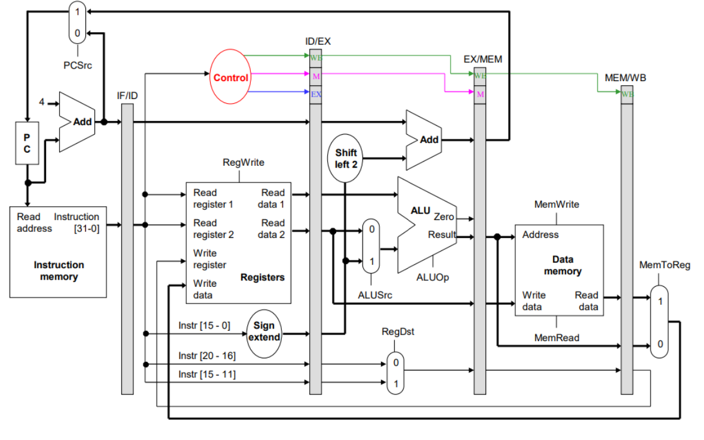

# RISC Processor

This repository is a verilog HDL implementation of RISC like processor with it's own set of Instruction Formats.

Go through the report for further information regarding the code and implementation [Report](./RISC_V_report.pdf)


## Datapath



## Files
```bash

final.v - Contains the final implementation of all modules coresponding to the processor.

finaltb.v - Contains the test bench for testing the implementation of the processor

main.xdc - file containing the configuration to simulate the processor on a nexys4 FPGA,
```
